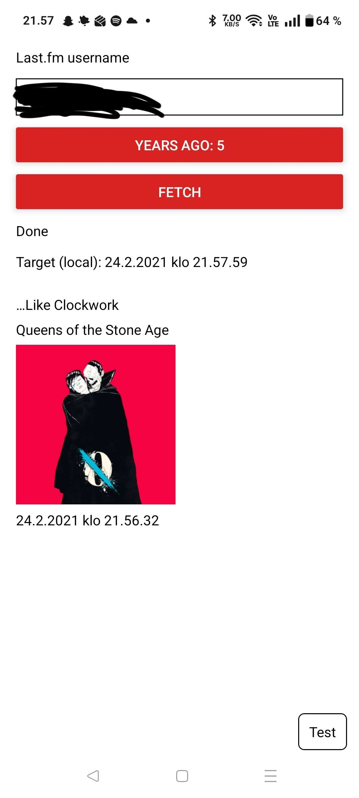

## mitä?

sovellus joka hakee last.fm käyttäjältä 1-5 vuotta sitten kuunnellun biisin noin samalta päivämäärältä ja kellonajalta

## miltä sen pitäisi näyttää

## julkisija käyttäjiä joita voi testata
- doublejradio2
- triplejradio2
- BBC6music
- BBCRADIO3
- BBCRADIO2
- BBC1Xtra
- BBCRADIO1

(joillakin käyttäjillä albumien kansitaiteet eivät näy puuttuvan metadatan takia)
